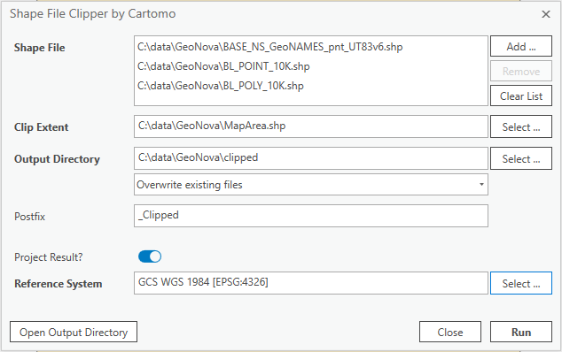

# Shape File Clipper Add-in for ArcGIS Pro
Shape File Clipper for Python rewritten as an Add-in for ArcGIS Pro. 

The project's intention is to explore ArcGIS Pro's .NET SDK, get familiar with the Windows Presentation Framework (WPF) and brush up my knowledge in C#. 

The Shape File Clipper Add-in may or may not add value to your workflow... You probably could just write a arcpy script or create a model to intergrate in your very own workflow and to achieve same outcome. :smirk:

## Screenshot

